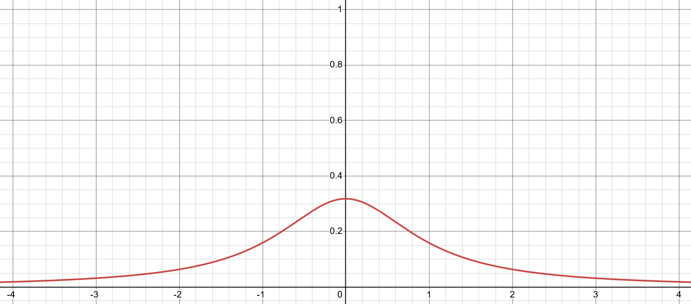
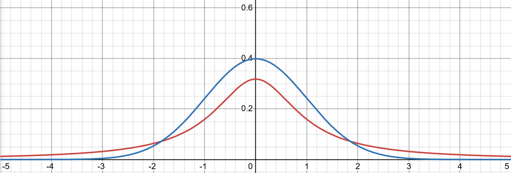

# Basic Properties Of The Cauchy Distribution
## Continuous Probability Distributions
The Cauchy is a *continuous* probability distribution. This means that the distribution is defined by an equation known as the *probability density function*, or PDF. 


*Desmos*

When we produce a random value from a distribution, we get a random x-coordinate with a likelihood that corresponds to the value of the density function at that coordinate. For the Cauchy curve shown above, this means that values around zero are more likely than values in the tails. All probability density functions have graphs such that the area under the curve is equal to one. This then allows us to interpret area-under-the-curve as probability:


*[Simplilearn](https://www.simplilearn.com/tutorials/statistics-tutorial/probability-density-function)*

A somewhat paradoxical result of this is that the probability of getting any particular value is actually **zero**, as the region under any single point on the graph is infinitely narrow. This is a bit weird, but it's actually fine. I won't get into the details, but you can find out more in [this video](https://www.youtube.com/watch?v=ZA4JkHKZM50).

The PDF for the *standard* Cauchy distribution is given by this equation:

$$
P(x) = \frac{1}{\pi(1 + x^2)}
$$

We can also introduce a scale parameter, $\gamma$, and a location parameter, $x_0$, to the above equation like this:

$$
P(x)=\frac{1}{\pi\gamma \left[ 1 + \left( \frac{x - x_0}{\gamma} \right)^2 \right]}
$$

The location parameter shifts the bell-curve around, while the scale parameter makes the curve wider or narrower. This gives us much finer control over the random values we expect to get from the distribution.


*Wikipedia - [Cauchy Distribution](https://en.wikipedia.org/wiki/Cauchy_distribution)*
## The Missing Mean And "Fat Tails"
How is it that the Cauchy distribution is able to have an undefined mean? A key influence is the fact is that the Cauchy has *fat tails* - that really is the appropriate technical term. Let's compare the Cauchy distribution to the Normal distribution again:


*Cauchy in red, Normal in blue*

The Cauchy distribution PDF drops off to zero at a much slower rate compared to the Normal distribution. This makes a typical set of random Cauchy values to be *significantly* more dispersed compared to a set of random Normal values. 

Without getting into the mathematical thickets, it is the fat tails which encourage the mean to be undefined for the Cauchy distribution (although fat tails don't necessarily result in a distribution with no mean). Let's say we are drawing samples from the Cauchy and calculating a running sample mean. At one moment, the fat tails means we might suddenly draw a value with a magnitude so extreme that our sample mean changes drastically. Intuitively this is why the sample mean can never settle down to converge on any stable value. 

**The fat-tails of the Cauchy turn out to be quite interesting from a game design perspective. This is one of the key things that I feel I learnt from making *Trash Idle*, and so we'll explore this deeper in the post-mortem.** 
## Generating Random Cauchy Values
How do we actually generate a random Cauchy value? We start with a random uniform value between zero and one, which we'll label $u$. We can then generate a Cauchy value using this equation:

$$
\text{Cauchy}(u)=x_0 + \gamma \tan(\pi(u-\frac{1}{2}))
$$

Here is an implementation for the Unity game engine:

``` C#
using UnityEngine;

public class CauchyDistribution
{
	public float Location = 0f;
	public float Scale = 1f;
	
	public float GetRandomValue()
	{
		float uniform = Random.value;
		float standardCauchy = Mathf.Tan(Mathf.PI * (uniform - 0.5f));
		float adjustedCauchy = Location + Scale * standardCauchyValue;
		return adjustedCauchy;
	}
}
```
