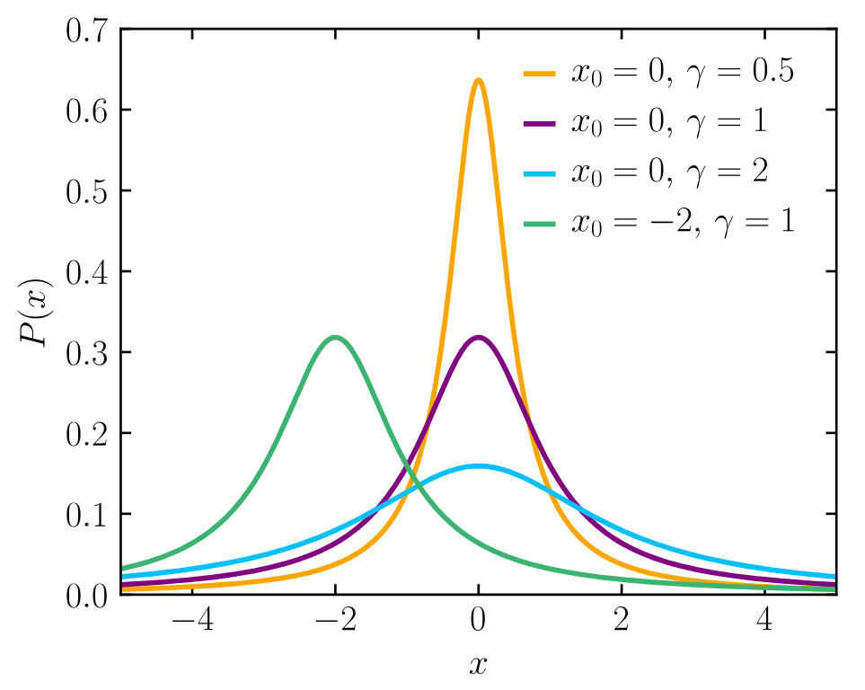

# Generating Random Cauchy Values
How do we actually generate a random Cauchy value? 

Here is an implementation for the Unity game engine:

``` C#
using UnityEngine;

public class CauchyDistribution
{
	public float Location = 0f;
	public float Scale = 1f;
	
	public float GetRandomValue()
	{
		float uniform = Random.value;
		float standardCauchy = Mathf.Tan(Mathf.PI * (uniform - 0.5f));
		float adjustedCauchy = Location + Scale * standardCauchyValue;
		return adjustedCauchy;
	}
}
```

The location parameter decides where the central lump of the distribution is located, while the scale parameter decides how spread out the distribution is. 

