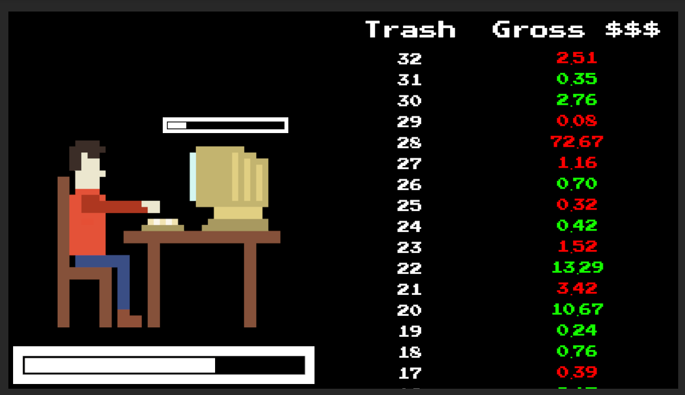

* With a standard Cauchy distribution, players are just as likely to end up with a net amount of positive *or* negative money. Usually negative money in a game is a strictly bad thing, but I thought I should allow it somehow. The idea was to present the player with upgrades in both directions, with positive money allowing access to the usual sort of stuff, while sufficient debt would allow access to *dark* upgrades. Aren't most governments in debt anyway?

* Using the location and scale parameter, the Cauchy reward could be biased in the positive or negative directions, and the likelihood of an extreme windfall could be influenced. At the start of the game, the Cauchy could be negatively biased and narrow, so the player is always losing but at least the stakes are low. As progress is made the player can start regularly making positive gains, with much greater potential for big wins and devastating losses. 

* At one point I imagined that the win-condition of the game would be to make a bazillion smackers. Rather than work towards this goal incrementally however, the game could be designed such that the player can only realistically achieve this goal through a single lucky roll. The Cauchy's *fat tails* should make implementing such a design more feasible, as extreme rolls are far more rewarding compared to more common distributions.

* Given the fat tails and volatile nature of Cauchy values, I thought multiple currencies would be necessary. These alternative currencies could be earned through more predictable distributions so that the game still has a solid structure and isn't totally chaotic. I then envisioned having different upgrade trees for each currency, giving each currency a different qualitative flavour.

* I also considered having several currencies make use of Cauchy distributions with different location and scale parameters. One could also link the Cauchy parameters to the present state of the player's various bank accounts. For example, lots of dollars might make it possible to start earning lots of yen. 

* I also considered a few ways of refreshing the player's typing interaction so that it stays relevant as progress is made. Initially it might not matter what the player types, but later on they are rewarded for avoiding repetition - I was very tempted by the mathematical problem of how to quantify the randomness of the player's input stream. 

* I also considered augmenting the typing with presses of particular keys like the space-bar or the backspace key. For example, if the player's typing represents lines of code, pressing the space-bar introduces tokens within each line, and bonus rewards might be on the table for lines of code with equally spaced tokens. Perhaps sometimes mistakes are introduced, and backspaces are necessary to produce a higher quality piece of trash.

*An early version of the game*
