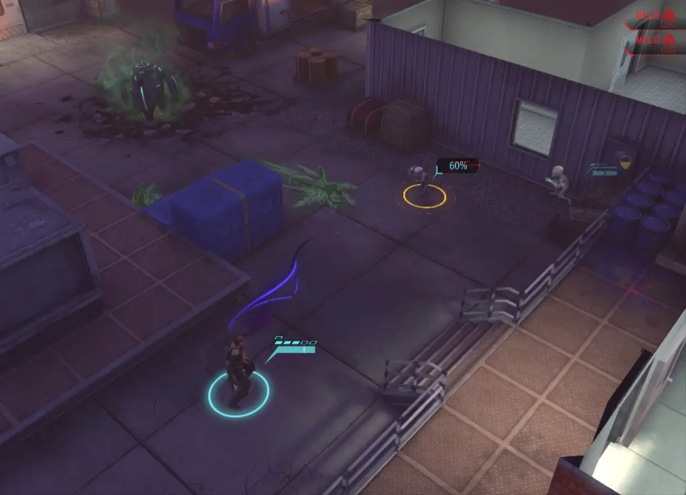
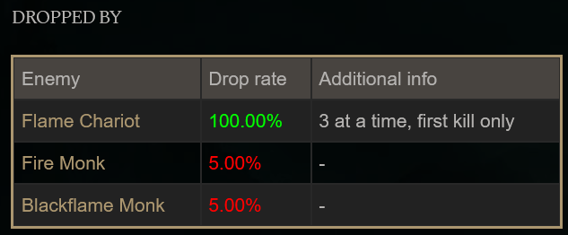
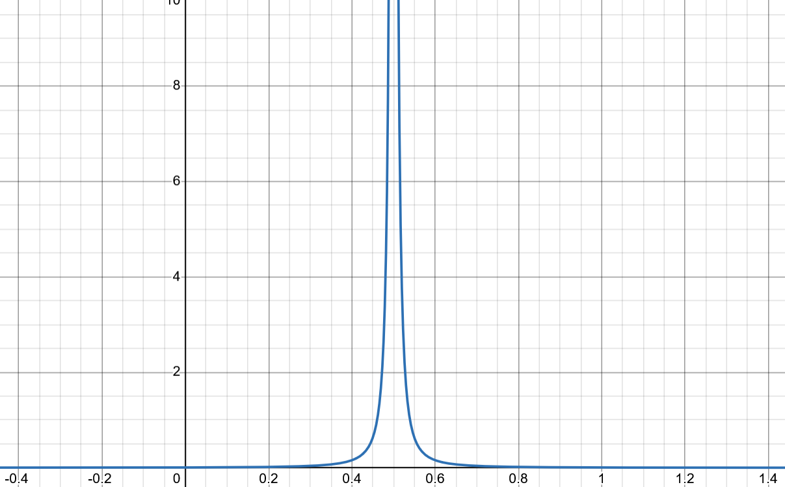
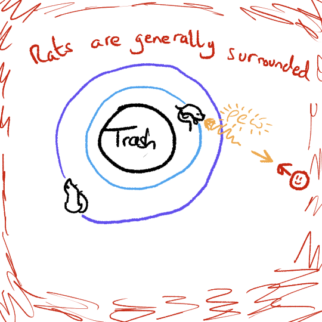

# Using The Cauchy Distribution In A Game
When trying to fit the Cauchy distribution in as a game design element, I initially considered two common scenarios. 
# Random Hit Chance
Lots of turn-based games have combat systems where an attack's chance to hit is decided by a random number.

Could you make a Cauchy weapon where the hit is still random, but it has no mean chance?

*XCOM ([Visible Hit Chance Mod](https://www.nexusmods.com/xcom/mods/661?tab=images))*
# Loot Tables
When you defeat an enemy in a game, your vanquished foe may randomly drop some equipment as loot. Players then frequently collect the loot information for each enemy into a Wiki page. For example, players of *Elden Ring* can go online to discover that they'll have to kill about 200 weak enemies if they want a rare sword, and people collect this sword despite the poor practical advantage of the weapon. 

Could you give the Wiki writers a Cauchy item that drops randomly, at no mean rate? How would they deal with such an item?

*Elden Ring Wiki - [Fire Blossom](https://eldenring.wiki.fextralife.com/Fire+Blossom)* (I **really** don't like that you have to farm this ingredient if you want to routinely use certain bombs)
# The Problem With The Cauchy Distribution
I could not work out how to use the Cauchy distribution to recreate the scenarios above.

Those two examples can be implemented like this:

1. Generate a random number uniformly between 0 and 1.
2. Is this number smaller than the chance to hit/chance to drop an item? 
   We register the hit/drop the item if it is.

There are two issues with using the Cauchy distribution to implement this.
## The Output Range
The natural place to insert the Cauchy distribution into the above is in step one, but a Cauchy random variable isn't restricted to lie between zero and one. Instead the distribution covers the entire real number-line. 

I've been tackling this issue but it's proven challenging. A natural idea is to use some of the distribution's parameters to *mostly* squish the function within the required range. We then ignore any values which are too extreme:

This *might* help, but it's nuanced and mathematically involved. I've separated the investigation of this idea into this note:

* [Truncating The Cauchy](Truncating%20The%20Cauchy.md)
## The Scenarios As "Decisions"
The other issue with using the Cauchy distribution to implement the above is to do with the nature of the scenarios themselves. Step two of the above implementation highlights that these scenarios ultimately result in a *Yes* or *No* decision being made based on a threshold value for the random variable. While the random variable might not have an average value, it does still have a well defined chance of being above or below a certain threshold. For example, there is a 50% chance for the random variable to be either above or below the peak at the centre of the distribution. 

I wanted to use the Cauchy distribution because of the weird fact that it lacks a mean value, but this quirk is irrelevant if we're implementing these scenarios like this. Perhaps there is some way of using the Cauchy to make decisions without there being an "average" yes/no answer, but I couldn't come up with anything.
# Cauchy Values As Currency
Because of the above issues, we'll have to use the random Cauchy values as they come. This means we need a gameplay element which can naturally take any value on the number line, both positive and negative. My first thought was to use the Cauchy values as a kind of damage or healing value. 

With both physics and the theme of the jam in mind, I thought about a game where you control a rat-atom that is under assault from incoming particles. The *Ratom* would have a trashball nucleus, while rats would orbit like electrons. In the spirit of quantum mechanics, the rats might randomly absorb particles to gain energy that they then randomly spit back out again. The rat lasers then defend the trashball from the particles. I thought about using Cauchy values to decide the damage of the incoming particles and/or the rat lasers.

This idea proved to be a bit clunky, although it did produce this amusing piece of "concept art":

*Rats Are Generally Surrounded*

Stripping the idea to its core, I realised that I was envisioning an [idle game](https://en.wikipedia.org/wiki/Incremental_game). The more natural idea in that case is to use the Cauchy values as the game's currency. I opened up a small canvas in Krita and drew the first thing that came to mind - a person sat at a computer:

The rest of the game flowed naturally after this drawing. As it was the pompous trash game jam, I would pompously self-insert as the man at the computer. I sit idly creating trash, hoping to hit the jackpot and make a lot of money.

[Part Two](./Post-mortem%2002.md)