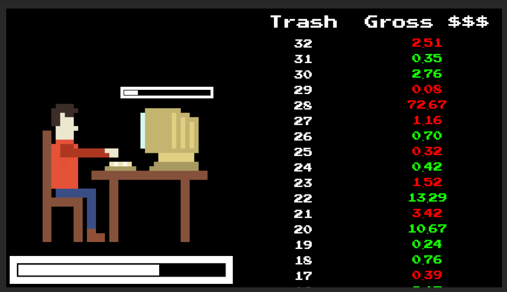
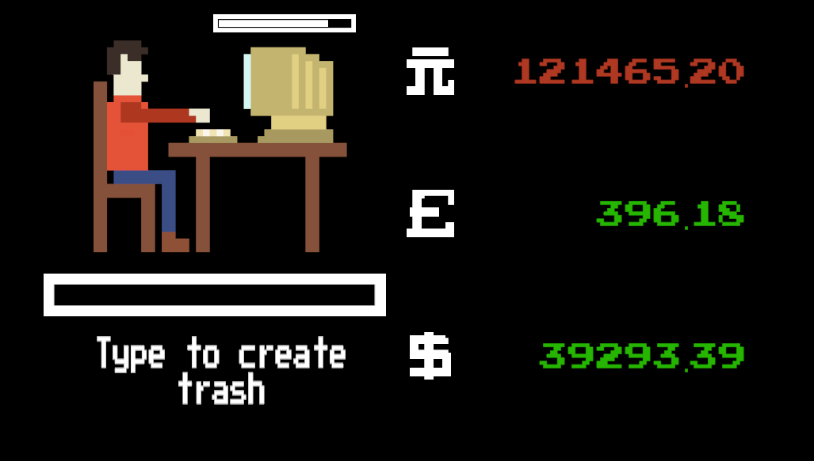

# Trash Idle - Development
I decided that the simplest way to bring the Cauchy distribution into a game was as a currency in an idle game. These types of games are also known as incremental games. 
# The Idle Game Format
In my mind, idle games generally have this kind of structure.

1. There is some kind of simple interaction for the player to perform, like a button click, which nets them a small amount of currency of some kind.
2. The player will quickly have enough money to purchase an upgrade which will automatically perform the interaction on the player's behalf. This first upgrade is generally pretty slow, such that the player can easily make more money by putting in the work themselves.
3. The game then introduces more upgrades to exponentially increase the effectiveness of the automatic currency gain. 
4. Pretty soon the player is better off letting the game play itself, and their role changes from mindless button-clicker to patient mega-fund manager. Satisfaction is derived from the immensely large amount of money to be gained, and the strategic decision making involved in spending that money on ever more ludicrous upgrades.

Not all idle games follow this structure, and there are distinctive variations within this structure like multiple different currencies to convert between. Here are some of the games I had in mind as I started on Trash Idle:

* **[Cookie Clicker](https://cookieclicker.com/)**
* **[AdVenture Capitalist](https://en.wikipedia.org/wiki/AdVenture_Capitalist)**
* **[(the) Gnorp Apologue](https://store.steampowered.com/app/1473350/the_Gnorp_Apologue/)** - My personal favourite
* A browser game where you grow larvae into many different classes of insect. Sadly I cannot remember the name of this game.

***(the) Gnorp Apologue***
# The Intended Design
After drawing the protagonist sat at his PC, it was natural to make typing the basic interaction of the game. 

To meet the jam's theme, I realised that the protagonist should be in the business of creating trash. What could then be more pompous than to self-insert and to make myself the protagonist? I sit at my computer creating trash, hoping one day to make a lot of money. The game's power-fantasy came together quite naturally. 

With enough typing, the player creates some trash and gets a reward. The value of the reward is where we can use the Cauchy distribution. The random value can either be positive or negative, so sometimes we lose money. Losing money is fine - it takes time to create trash and time is money. 

*First Draft*

I then had a few ideas which I thought could make for an interesting game. I'll quickly mention them here before we move onto the finished game and what I learnt about the Cauchy distribution from this project.

* With a standard Cauchy distribution, players are just as likely to end up with a net amount of positive *or* negative money. Usually negative money in a game is a strictly bad thing, but I thought I should allow it somehow. The idea was to present the player with upgrades in both directions, with positive money allowing access to the usual sort of stuff, while sufficient debt would allow access to *dark* upgrades. Aren't most governments in debt anyway?

* Using the location and scale parameter, the Cauchy reward could be biased in the positive or negative directions, and the likelihood of an extreme windfall could be influenced. At the start of the game, the Cauchy could be negatively biased and narrow, so the player is always losing but at least the stakes are low. As progress is made the player can start regularly making positive gains, with much greater potential for big wins and devastating losses. 

* At one point I imagined that the win-condition of the game would be to make a bazillion smackers. Rather than work towards this goal incrementally however, the game could be designed such that the player can only realistically achieve this goal through a single lucky roll. The Cauchy's *fat tails* should make implementing such a design more feasible, as extreme rolls are far more rewarding compared to more common distributions.

* Given the fat tails and volatile nature of Cauchy values, I thought multiple currencies would be necessary. These alternative currencies could be earned through more predictable distributions so that the game still has a solid structure and isn't totally chaotic. I then envisioned having different upgrade trees for each currency, giving each currency a different qualitative flavour.

* I also considered having several currencies make use of Cauchy distributions with different location and scale parameters. One could also link the Cauchy parameters to the present state of the player's various bank accounts. For example, lots of dollars might make it possible to start earning lots of yen. 

* I also considered a few ways of refreshing the player's typing interaction so that it stays relevant as progress is made. Initially it might not matter what the player types, but later on they are rewarded for avoiding repetition - I was very tempted by the mathematical problem of how to quantify the randomness of the player's input stream. 

* I also considered augmenting the typing with presses of particular keys like the space-bar or the backspace key. For example, if the player's typing represents lines of code, pressing the space-bar introduces tokens within each line, and bonus rewards might be on the table for lines of code with equally spaced tokens. Perhaps sometimes mistakes are introduced, and backspaces are necessary to produce a higher quality piece of trash.
# The Finished Game
As it turns out, I ran out of time before I could implement any of these ideas! 

I built the necessary code modules and UI to playtest a few of these things out, but the impending jam deadline meant I had no choice but to strip back to a very barebones but functional interactive experience. 

*Trash Idle*

In the finished game, trash is automatically generated on the player's computer, but hitting any letter-key creates additional progress. Once the trash has been finished, the game rewards the player in either 元 (Chinese yuan), £ (Sterling), or $ (Dollars), with an equal chance for each. 

The amount in 元 is drawn from a standard Cauchy distribution, the amount in £ is drawn uniformly between zero and one, while the amount in $ is drawn from something called a Lorentzian function. 

I lifted the Lorentzian function from the Wikipedia page on the Cauchy distribution, but I honestly don't know anything about it. From playtesting I have deduced that on average the player will have about a hundred times more $ compared to £.  