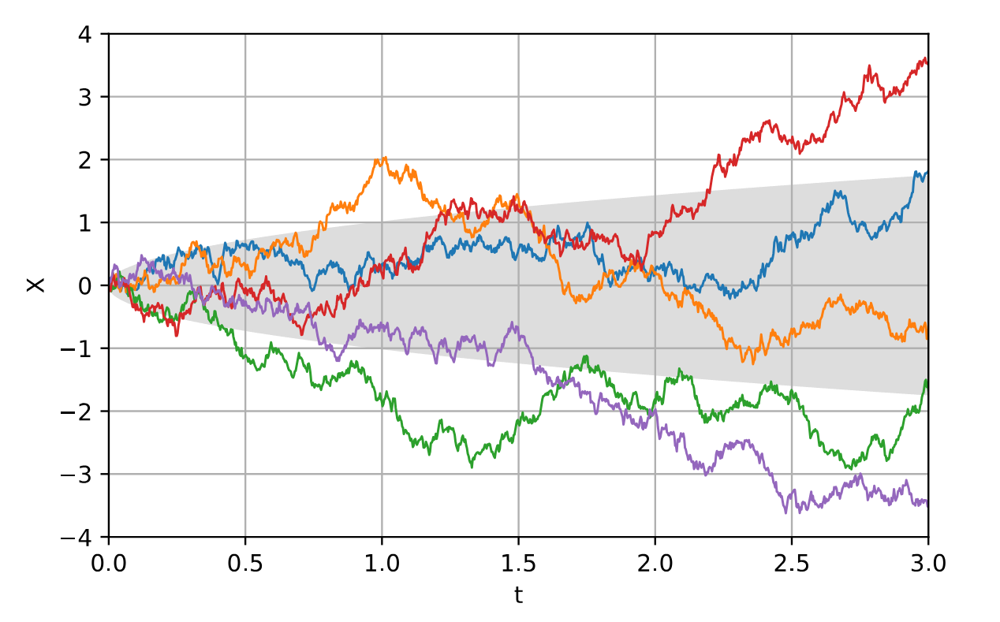

# Trash Idle - Playtesting The Cauchy
With the game submitted, I sent it to a few friends for them to try and make sense of. Most of them knew nothing about the game going into the experience, and a few of the playtests were live on a call.

I didn't really get to implement any of the classic idle-game features, and if we're being honest, there's not much for players to really do. People weren't aware of what was planned or intended however, and they were quite curious about what was going on. Several people were able to convince themselves that what they typed influenced how much money they got, as well as which currency they would be rewarded in.

It was a little embarrassing to then reveal that many of those features were planned, but were not implemented. However for me it was really entertaining to see people look for meaning in what was actually a random experience. As expected, people did enjoy mashing away at their keyboards!
# Understanding The Cauchy As A Game Design Element
Of course the most important thing is what Trash Idle can demonstrate about the Cauchy distribution as a game design element. Let's examine the behaviour of the three currencies as the game plays out.
## The Clock-like Nature Of Sterling 
We'll start with the amount in sterling, as that uses the simplest function. When we earn an amount in sterling, we simply draw a random number uniformly in the range \[0, 1\]. 

As I watched people play the game, I realised that each player's worth in sterling is a good measure of how many pieces of trash they have created. There's a 0.33 chance that each piece of trash will reward the player in sterling, and the average reward is £0.50. Multiplying these two results together, each piece of trash has an average reward in Sterling of £0.16. 

In the early stages of the game, there's too much variability for this to work. However once they've been playing for long enough, we can look at their worth in sterling and interpret the result as a measure of how many pieces of trash they've created. An alternative interpretation is that the worth in sterling is a measure of how long they have been playing, with the caveat that by typing on the keyboard the player can "speed up the clock".

Of course, the value in sterling isn't a perfect measure of how many pieces of trash have been made. Different players will have gotten different random rolls and will have accumulated different amounts. 

Let's say 30 players play the game until they have created 1,000 pieces of trash each. The *expected* worth at this time is £160, and we intuitively understand that each player will be randomly scattered close to this value. Why is this however? How scattered around it can we actually expect them to be? These questions are answered by the Central Limit Theorem, and we will return to this after examining the other two currencies.
## The Relatively Boring Nature Of Dollars
Next we will take a quick look at the behaviour of the player's amount in dollars. I used an equation for something called a Lorentzian function from a Wikipedia page on the Cauchy distribution.

After observing the behaviour of this currency for some time, all I have determined is that the player generally ends up with about one hundred times as many dollars compared to pounds sterling. We can thus determine that, on average, each piece of trash is worth about $16. 

All of the prior discussion of sterling can apply to dollars as well then, which makes its inclusion in the game relatively boring I think.
## The Randomly Walking Nature Of Yuan
Now for the main event - the value of a piece of trash in yuan is drawn from a standard Cauchy distribution. How does it behave?

The evolution of that player's worth in yuan is an example of a *one-dimensional random walk*. Fittingly, these kinds of processes are actually used to model financial markets. 

*Wikipedia: [Wiener Process](https://en.wikipedia.org/wiki/Wiener_process)*

These kinds of processes have been extensively studied, and there are lots of known results about them. *However*, our randomly walking yuan is actually a bit special. The mathematical details are somewhat out of scope, but the difference can be demonstrated visually by performing a random walk in two-dimensions:

*Wikipedia: [Levy Flight](https://en.wikipedia.org/wiki/L%C3%A9vy_flight)*

We can see that the Cauchy distribution has a much higher probability of making extreme jumps. The walker often spends time clustered around a particular location, before making a significant jump to explore somewhere else. Unsurprisingly, animals have been observed behaving like this when scavenging for food at times of scarcity.

This behaviour is because the distribution has **fat tails** - that really is the appropriate technical term. While I struggled to make use of the fact that the Cauchy distribution has no mean value, I have realised that the distribution's fat tails are actually quite interesting from a game design perspective. Let's look at an example.
### Winning The Cauchy Lottery
Let's say you have a game which contains some kind of random lottery. You are playing the game are you get an amazingly lucky roll. How much money do you win? Let's compare the Normal distribution to the Cauchy distribution:

| Player's Luck            | Normal Distribution Reward | Cauchy Distribution Reward |
| ------------------------ | :------------------------: | :------------------------: |
| One in ten               |            1.28            |            3.08            |
| One in a hundred         |            2.33            |           31.82            |
| One in a thousand        |            3.09            |           318.31           |
| One in a million         |            4.26            |          ~320,000          |
| One in a billion         |            5.61            |        ~320,000,000        |
| One in a million billion |            6.71            |      ~320,000,000,000      |

The difference is *extreme*. An amazingly lucky one-in-a-million-billion player doesn't actually get much of a reward from the Normal distribution, but the Cauchy distribution simply doesn't stop giving. 

I actually experienced this myself while playing Trash Idle. I looked down for a moment, and when I looked back up I had scored an incredible 120,000 yuan - in the negative direction 😅 

I calculated the probability of a single roll this extreme as being about 1/250,000!

I let this run continue to play for a really long time, but that one roll was so rare and thus extreme that my yuan barely moved:

(Recall how sterling tracks the amount of trash created)

This might demonstrate the double-edged nature of the fat-tailed distribution however. How could you balance such extreme rolls? 

You'd have to build a game where their possibility is accounted for, and this could produce the kind of unique experience which I was trying to find. 
# The Secret Normal Distribution In Games
Why make all these comparisons to the Normal distribution anyway? My game doesn't even make use of the distribution, and few games explicitly use it as well.

Well let's return to our scenario from before. We have 30 players running Trash Idle until they've created a thousand pieces of trash each. We know the players will be scattered around with an average worth of £160, but how exactly are they distributed?

You guessed it - they're distributed according to a Normal distribution. It is finally time to explore the Central Limit Theorem. 

[Part Four](./Post-mortem%2004.md)