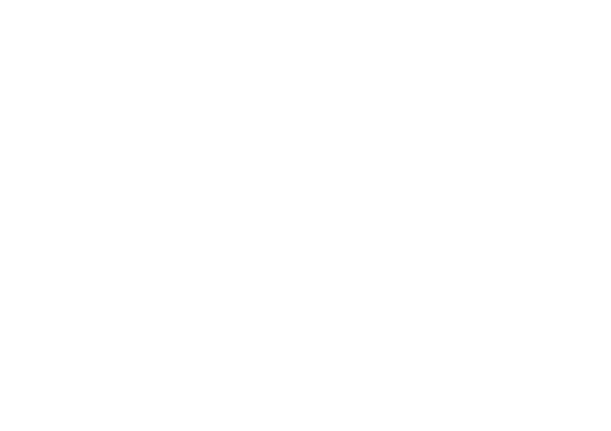
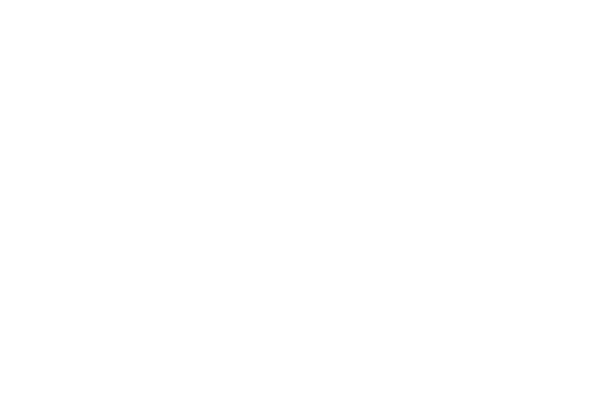

# The Central Limit Theorem
I think this is one of the biggest lessons that I learned from making Trash Idle. I set out to make a game where the Cauchy distribution was a game design element, and I then realised that the Normal distribution is already a near universal but hidden element in practically all games.
# Rolling The Dice
Consider rolling two dice, and taking the average of their values. This sample mean is itself a random variable, as its value is random according to whatever two values happen to appear on the two dice. 

The most common scenario is that the sum of the dice values is 7, and so the most common sample mean will be 3.5. There is only a single combination which produces a sum of 2 or 12 however, so we're less like to find a sample mean of 1 or 6. We can plot this behaviour on a histogram:

The above histogram represents the probability of the mean value of two dice rolls. What if we increase the number of dice rolls? 

*[Source](https://people.hsc.edu/faculty-staff/blins/StatsExamples/CentralLimit/)*

As the number of dice rolls increases, the distribution of the sample mean value increasingly resembles that of a Normal distribution centred at the true population mean of 3.5! Furthermore, the distribution is becoming narrower as the number of rolls increases. This is the *Central Limit Theorem*, or **CLT**, and it is the reason why we expect the average value of dice rolls to get closer to 3.5 over time. The theorem states that the probability distribution for the average value of your samples approaches a Normal distribution over time. More precisely, the rate of approach is proportional to `Sqrt(N)`, where `N` is the number of samples.

An important feature of the theorem is that it does not matter what underlying distribution was used to create the random samples: 

* **If your game uses dice, or has random hit chances, or random loot drops, the Normal distribution is present in your game.**

As a more practical example, consider a game like XCOM again. Early on in the game, levels might only have a few aliens, with very little health. In order to kill all the aliens and beat the level, the XCOM agents might only need to fire their weapons a handful of times. However, later levels are full of many high-health aliens, and take much longer to complete. The player will be making many many random rolls throughout the later level, and thus the CLT is more strongly in play. Different players might experience lots more variability in their luck in the smaller levels, but can generally expect to be equally lucky in the later levels. If one player has a mathematically unsound strategy, they might get lucky in small levels but get inevitably crushed in larger levels. 
# Breaking Free Of The Central Limit Theorem

One consequence of the CLT is that the Normal distribution is "stable". This means that if we take a bunch of Normally distributed samples, then their average value is also Normally distributed. I kind of think of the Normal distribution like a great attractor that sucks in other distributions and doesn't let them leave:

*Binomial distributions answer questions like "For a given hit chance, what is the probability of X hits?"* *Poisson distributions resolve "For a given average number of ore deposits per square-km, what is the probability of X deposits?"*

In the proof of the Central Limit Theorem, one assumes that the underlying distribution of the samples has a finite **variance**. The variance is a measure of the dispersion of the distribution around its means value. However, the fat-tailed Cauchy distribution has infinite variance! Thus the Cauchy distribution does not obey the CLT. Furthermore, the Cauchy distribution turns out to *also* be stable. Thus we can use the Cauchy distribution to break free from the CLT! 

I was unlikely to get a statistically significant number of people playing my game concurrently, but unless another game has ever made use of the Cauchy distribution, Trash Idle might be the first game to ever has its players distributed in a non-Normal fashion. Could *this* be an interesting concept for designers of multiplayer games? 

[Part Five](./Post-mortem%2005.md)