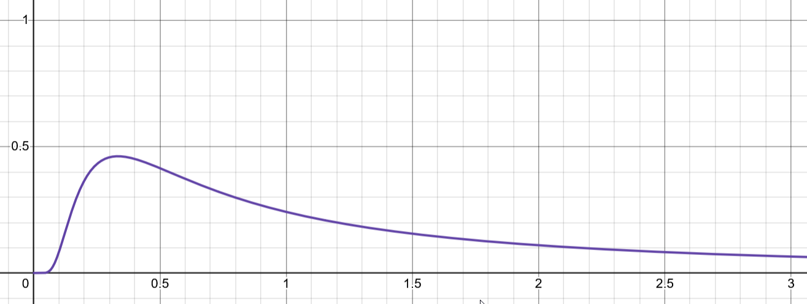

# Conclusions And Future Ideas
I feel we have learned all we can from Trash Idle's use of the Cauchy distribution. In summary, this is what I feel I have learned:

* The Cauchy distribution isn't quite able to recreate some of the most common RNG scenarios like random hit chances or loot drops. It may instead work best as a source for some kind of currency because the Cauchy samples can take any positive or negative value on the number line.
* The distribution can be used to create unique random-walks throughout a parameter space. The walkers will explore a particular location for some time, before making an extreme jump somewhere else. 
* The Cauchy distribution has **fat tails**. These massively amplify the impact of rare rolls.
* While often not explicitly included, the Normal distribution is present in practically all games as a consequence of the **Central Limit Theorem**. 
* Because the Cauchy distribution is a stable distribution with infinite variance, it does not obey the CLT. Player's of a game using the Cauchy distribution are free from the CLT, and can be distributed in a fat-tailed manner - thus the rarest of lucky players might benefit from extreme boons.

*An early draft for Trash Idle*
# What Next?
There is a final thing I discovered while making the game. The Cauchy distribution is not the only fat-tailed stable distribution...

In fact, there is a whole family of curves known as the **Lévy alpha-stable distributions**. Most of these distributions cannot be written down in neat forms, but along with the Cauchy distribution there is one other such distribution: the **Lévy distribution**:

*Levy Distribution*

*Normal distribution is blue, Cauchy is red*

The Levy distribution is also fat-tailed, and is stable. Thus it is also free from the Central Limit Theorem, and can throw out some *extreme* values for the luckiest of rolls. Comparing it to both the Cauchy distribution and Normal distribution however, we've now got such a distribution which is *strictly positive* and asymmetric. Unlike the Cauchy, it does have a well-defined means value. Well, it actually has *infinite* mean! 

Because it is strictly positive, this might be the more interesting distribution to make use of. A friend of mine suggested a shotgun where the number of pellets is Levy distributed, which is an idea that I love. I think this will be the next thing I explore.

Thanks for reading! Get in touch if you have questions.

* [Discord](https://discordapp.com/users/699375169398898688)
* [Email](mailto:robertclose@pm.me) 
