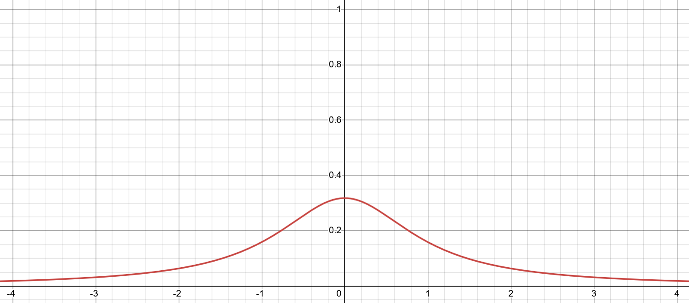
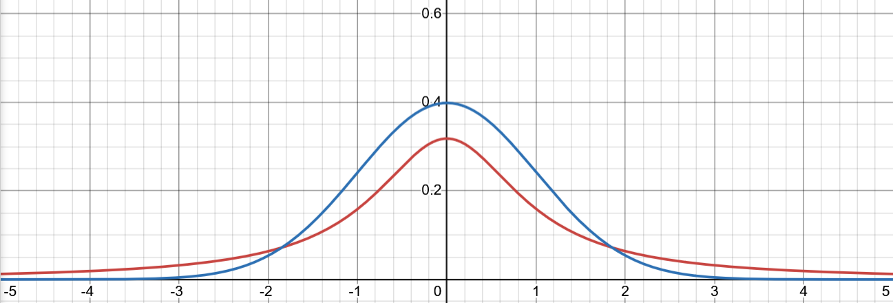

# Trash Idle Post-mortem
I recently made a game called **Trash Idle**, and it looks like this! 

You can play the game [here](https://justrobjustrobjustrob.itch.io/trashy-idle). I recommend getting it running and leaving it in the background while you read about it here.

The game was my submission to the [Pompous Trash Jam 2025](https://itch.io/jam/pompous-trash-2025), and I used the occasion as an opportunity to try using an experimental game-design element that has been on my mind for some time.
# An Unusual Source Of Random Numbers
Several years ago while studying physics I came across a probability distribution with an interesting property: it has no average value. 

If you use this distribution to generate some random numbers, and you calculate the average of your samples, the resulting number can't be predicted ahead of time for this distribution. You can calculate a well defined average for *your* samples, but the resulting average will generally never agree with anyone else's samples. Drawing more samples won't help, your average value will forever jump around without purpose.

The probability distribution in question is called the **Cauchy Distribution**, and its probability density function looks like this:

*Desmos*

This is a well-know shape - it's a bell-curve! It is not however, *the* bell curve known as the **Normal Distribution**. 

The Normal distribution is arguably the most important probability distribution in all of maths and science, and it has an almost universal role in modelling a massive range of situations involving random numbers. This is because of a result known as the **Central Limit Theorem**, which we will meet again later.

*Desmos* - The Cauchy distribution is in red, while the Normal distribution is in blue.

Given its visual similarity to the Normal distribution, I found it hard to believe that the Cauchy bell-curve has no average value. Surely they both have their average value right there in the middle? 

What I wanted to explore was if the Cauchy distribution could be used to create some interesting experiences for players in a game. Random numbers are already a common game design-element, and I think most players are generally familiar with how randomness is used in games - could this distribution catch players by surprise? Would players be able to tell something strange is going on? 

* [Post-mortem Part One](./Post-mortem%2001.md)
* [Generating Cauchy Samples](./Generating%20Cauchy%20Samples.md)